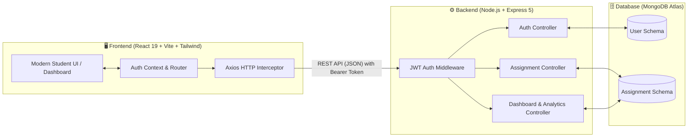

<div align="center">

# 📚 Student Assignment Tracker
### **Modern Full-Stack MERN Academic Productivity & Workflow Management Platform**

[](https://react.dev/)
[](https://vitejs.dev/)
[](https://tailwindcss.com/)
[](https://nodejs.org/)
[](https://expressjs.com/)
[](https://www.mongodb.com/atlas)
[](LICENSE)

<p align="center">
  <b>Official Repository:</b> <a href="https://github.com/akshayamv-0909/Student_Assignment_Tracker">https://github.com/akshayamv-0909/Student_Assignment_Tracker</a><br>
  <i>"Organize Deadlines. Track Progress. Master Your Academic Journey."</i>
</p>

</div>

---

## 📖 Overview

**Student Assignment Tracker** is a production-grade, full-stack **MERN** (MongoDB, Express.js, React.js, Node.js) web application engineered to solve academic disorganization, missed submission deadlines, and student burnout.

With an intuitive, minimalist UI and robust backend architecture, the platform empowers students and academic faculty to manage coursework, monitor submission statuses, automate overdue tracking, and analyze productivity metrics in real time.

```
+-------------------------------------------------------------------------------+
|                           STUDENT DASHBOARD OVERVIEW                          |
+-------------------+-------------------+-------------------+-------------------+
|  Total Tasks: 24  |   Completed: 18   |    Pending: 4     |    Overdue: 2     |
+-------------------+-------------------+-------------------+-------------------+
| Progress: [████████████████████████░░░░] 75% Completion Rate                  |
+-------------------------------------------------------------------------------+
```

---

## ✨ Key Features

- 🔐 **Secure Authentication & Authorization**:
  - JWT (JSON Web Tokens) with encrypted bcrypt password hashing.
  - Persistent login state via React Context API (`AuthContext`) and local storage.
  - Protected API routes and role-based access control.

- 📋 **Full Lifecycle Assignment Management (CRUD)**:
  - Create, view, update, and delete assignments with title, description, course/subject, due date, and priority level.
  - Quick action to toggle status between `Pending`, `In Progress`, and `Completed`.

- ⏱️ **Automated Overdue Detection**:
  - Server-side business logic automatically recalculates and flags assignments as `Overdue` when deadlines pass without completion.

- 📊 **Real-Time Analytics Dashboard**:
  - Aggregate summary cards for **Total**, **Completed**, **Pending**, and **Overdue** assignments.
  - Dynamic completion progress bar reflecting real-time academic standing.

- 🔍 **Smart Search & Multi-Criteria Filtering**:
  - Instant live search by keyword or assignment title.
  - Multi-dimensional filters by **Subject/Course**, **Priority (High / Medium / Low)**, and **Status**.

- 🎨 **Modern Responsive UI / UX**:
  - Crafted with React 19, Tailwind CSS v3.4, and Lucide React icons.
  - Desktop, tablet, and mobile-optimized layouts with accessible color contrast.

---

## 🏛️ System Architecture



---

## 🛠️ Technology Stack

| Layer | Technologies Used |
| :--- | :--- |
| **Frontend Framework** | **React 19**, **Vite 8**, React Router DOM v7 |
| **Styling & Icons** | **Tailwind CSS v3.4**, PostCSS, Autoprefixer, **Lucide React** |
| **State & Networking** | React Context API, **Axios**, `date-fns`, `clsx`, `tailwind-merge` |
| **Backend Runtime** | **Node.js**, **Express.js 5** (RESTful API MVC architecture) |
| **Database & ODM** | **MongoDB Atlas**, **Mongoose 9** |
| **Security & Auth** | **JSON Web Tokens (JWT)**, **bcryptjs**, CORS, Dotenv |
| **Code Quality** | Oxlint, ESLint |

---

## 📂 Project Structure

```bash
Student_Assignment_Tracker/
├── PRD.md                         # Product Requirements Document & Specifications
├── walkthrough.md                 # Setup walkthrough & verification guide
│
├── client/                        # React Frontend Application
│   ├── index.html                 # Single Page Application entry
│   ├── package.json               # Frontend dependencies & scripts
│   ├── vite.config.js             # Vite 8 build configurations
│   ├── tailwind.config.js         # Custom Tailwind theme & color tokens
│   └── src/
│       ├── App.jsx                # Router configuration & main layouts
│       ├── context/
│       │   └── AuthContext.jsx    # User authentication provider & state
│       ├── components/            # Reusable UI cards, tables, modals & navbars
│       ├── pages/                 # Dashboard, Assignments, Login, Register
│       └── services/              # Axios API service handlers
│
├── server/                        # Node.js Express REST API
│   ├── index.js                   # Server entry point & DB connection
│   ├── package.json               # Backend dependencies
│   ├── .env.example               # Backend environment template
│   ├── models/
│   │   ├── User.js                # User identity & password hash schema
│   │   └── Assignment.js          # Assignment data model & overdue logic
│   ├── controllers/
│   │   ├── authController.js      # Register & Login controllers
│   │   ├── dashboardController.js # Analytics & summary aggregation
│   │   └── facultyController.js   # Faculty overview & batch tracking
│   ├── routes/
│   │   ├── auth.js                # Auth endpoints
│   │   ├── assignments.js         # Assignment CRUD routes
│   │   ├── dashboard.js           # Analytics routes
│   │   └── faculty.js             # Faculty routes
│   └── middleware/
│       └── auth.js                # JWT token validation middleware
│
└── stitch_modern_student_dashboard/ # UI mockups, assets, and screen prototypes
```

---

## 🚀 Quickstart Guide

### Prerequisites
- [Node.js](https://nodejs.org/) (v18.0.0 or higher)
- [MongoDB Atlas Account](https://www.mongodb.com/cloud/atlas) or a local MongoDB instance
- [Git](https://git-scm.com/)

---

### Step 1: Clone the Repository
```bash
git clone https://github.com/akshayamv-0909/Student_Assignment_Tracker.git
cd Student_Assignment_Tracker
```

---

### Step 2: Configure & Start the Backend (`/server`)

1. Navigate to the `server` directory:
   ```bash
   cd server
   npm install
   ```

2. Create a `.env` file in `server/.env`:
   ```env
   PORT=5000
   MONGO_URI=mongodb+srv://<username>:<password>@cluster0.mongodb.net/assignment_tracker?retryWrites=true&w=majority
   JWT_SECRET=your_jwt_secret_key_minimum_32_characters
   ```

3. Start the backend server:
   ```bash
   npm start
   # or node index.js
   ```
   *You will see: `Server running on port 5000` & `MongoDB Connected`.*

---

### Step 3: Configure & Start the Frontend (`/client`)

1. Open a new terminal and navigate to the `client` directory:
   ```bash
   cd client
   npm install
   ```

2. Start the Vite development server:
   ```bash
   npm run dev
   ```

3. Open your browser and navigate to:
   ```text
   http://localhost:5173
   ```

---

## 🔌 API Reference

All protected endpoints require the header:  
`Authorization: Bearer <JWT_TOKEN>`

### Authentication Endpoints
| Method | Endpoint | Description | Payload |
| :--- | :--- | :--- | :--- |
| `POST` | `/api/auth/register` | Register a new student account | `{ name, email, password }` |
| `POST` | `/api/auth/login` | Authenticate user & receive JWT token | `{ email, password }` |

### Assignment Endpoints
| Method | Endpoint | Description | Payload / Response |
| :--- | :--- | :--- | :--- |
| `GET` | `/api/assignments` | Fetch all user assignments (with filters) | Returns array of assignments |
| `POST` | `/api/assignments` | Create a new assignment | `{ title, subject, dueDate, priority, description }` |
| `PUT` | `/api/assignments/:id` | Update assignment details or mark completed | `{ status, dueDate, priority, ... }` |
| `DELETE` | `/api/assignments/:id` | Remove an assignment | `{ success: true, message: "Deleted" }` |

### Analytics & Dashboard
| Method | Endpoint | Description | Response |
| :--- | :--- | :--- | :--- |
| `GET` | `/api/dashboard/stats` | Fetch aggregated user productivity stats | `{ total, completed, pending, overdue, progressPercentage }` |

---

## 🔮 Roadmap & Future Scope

- [ ] 📅 **Google Calendar Two-Way Sync** for instant schedule integration.
- [ ] 🔔 **Email & Push Reminders** 24 hours before assignment due dates.
- [ ] 🤖 **AI Study Plan Generator** that breaks assignments into daily subtasks.
- [ ] 📎 **Cloud File Attachments** (PDF, docs, code files) via AWS S3 / Cloudinary.
- [ ] 🏆 **Gamification Engine** with study streaks and achievement badges.

---

## 🤝 Contributing

Contributions are what make the open source community such an amazing place to learn, inspire, and create. Any contributions you make are **greatly appreciated**.

1. Fork the Project (`https://github.com/akshayamv-0909/Student_Assignment_Tracker/fork`)
2. Create your Feature Branch (`git checkout -b feature/FeatureName`)
3. Commit your Changes (`git commit -m 'Add FeatureName'`)
4. Push to the Branch (`git push origin feature/FeatureName`)
5. Open a Pull Request

---

## 📄 License

Distributed under the **MIT License**. See `LICENSE` for details.

---

<div align="center">
  <sub>Developed by <a href="https://github.com/akshayamv-0909">@akshayamv-0909</a></sub>
</div>
